<table style="width:100%; border:0;">
	<tr>
		<td style="width:18%; text-align:left; border:0;">
			
		</td>
		<td style="width:64%; text-align:center; border:0;">
			<strong>UNIVERSIDADE PRESBITERIANA MACKENZIE</strong> 
			<strong>Faculdade de Computação e Informática</strong> 
			Prof. Dr. Ivan Carlos Alcântara de Oliveira 
			Teoria dos Grafos
		</td>
		<td style="width:18%; text-align:right; border:0;">
			
		</td>
	</tr>
</table>

	<h2 style="margin-bottom:0;">Proposta de Projeto – Parte 1</h2>
	<strong>Informações</strong> 
	<strong>(Máx. 3 alunos)</strong>

| Nome do Integrante | RA |
|---|---|
| Lucas Fernandes de Camargo | 10419400 |
| Lendy Naiara Carpio Pacheco | 10428525 |
| Anna Luiza Stella Santos | 10417401 |

### Informações sobre o Projeto

**Título provisório:** Rede de Acesso SP

**Área(s)/Tema(s) relacionados(as):**
Saúde, smart cities, análise urbana, desigualdade territorial.

**Pretende utilizar em outras disciplinas?** (X) Sim &nbsp;&nbsp; ( ) Não

**Caso seja utilizado em outras disciplinas, informe quais:**
- Nome Disciplina 1: IHC – Interação Humano Computador
- Nome Disciplina 2:
- Nome Disciplina 3:

**Esta proposta está relacionada ao TCC?** ( ) Sim &nbsp;&nbsp; (X) Não

**Tecnologia que o grupo pretende utilizar:** ( ) C &nbsp; ( ) C++ &nbsp; (X) Python &nbsp; ( ) Java

**Descrição da proposta:**
Modelagem por Teoria dos Grafos da rede de acesso territorial a serviços de saúde no município de São Paulo, com análise de conectividade e suporte a visualizações para evidenciar desigualdades regionais.

---

## 1) Título provisório da aplicação

**SPGraph — Análise de Acesso Territorial a Serviços de Saúde em São Paulo**

## 2) Introdução

Este relatório apresenta os resultados da Atividade Projeto — Parte 2, com foco na modelagem de um problema real por Teoria dos Grafos e implementação de uma aplicação em Python para leitura, gravação e manipulação de grafos no formato exigido pela disciplina.

A solução foi construída com lista de adjacência e menu textual (`a` até `j`), cobrindo as operações obrigatórias e a análise de conectividade do grafo.

## 3) Definição do problema real selecionado (descrição detalhada)

### 3.1 Contexto

A distribuição espacial de serviços de saúde no município de São Paulo não é uniforme. Isso gera diferenças de acesso entre distritos, especialmente quando se considera conectividade territorial e distância entre regiões.

### 3.2 Formulação em grafos

- **Vértices:** distritos administrativos de São Paulo.
- **Arestas:** adjacências geográficas entre distritos.
- **Peso de vértice:** população do distrito.
- **Peso de aresta:** distância estimada (km) entre distritos adjacentes.

### 3.3 Tipo do grafo utilizado

No arquivo [grafo.txt](grafo.txt), foi utilizado:

- **Tipo 3** — grafo **não orientado** com **peso nos vértices e nas arestas**.

### 3.4 Escala final da modelagem

- Número de vértices: **71**
- Número de arestas: **215**

Validação dos mínimos exigidos no enunciado:

- $71 \ge 70$ vértices
- $215 \ge 180$ arestas 

### 3.5 Vinculação explícita com ODS (Saúde e Desigualdade)

Este projeto está diretamente alinhado com duas frentes da Agenda 2030:

- **ODS 3 — Saúde e Bem-Estar**
- **ODS 10 — Redução das Desigualdades**

No recorte do problema, a cidade é representada por distritos (vértices) e conexões territoriais (arestas), permitindo analisar diferenças de acesso à saúde entre regiões. Assim, a modelagem não trata apenas de distância geográfica, mas também de desigualdade territorial de acesso a serviços essenciais.

Contribuição para a **ODS 3**:

- evidencia a estrutura de acesso territorial a serviços de saúde;
- permite identificar regiões potencialmente mais vulneráveis por baixa conectividade;
- fornece base analítica para priorização de ações em saúde pública.

Contribuição para a **ODS 10**:

- torna comparável o acesso entre distritos com diferentes condições urbanas;
- mostra assimetrias de conectividade e deslocamento entre áreas da cidade;
- apoia decisões voltadas à redução de desigualdades no atendimento à população.

Em síntese, o grafo modelado funciona como instrumento técnico para observar e comunicar desigualdades de acesso à saúde, conectando o problema real selecionado às metas de saúde e equidade social.

## 4) Estudo de caso com dados reais

Bases de dados reais usadas na preparação do modelo:

- `deinfosacadsau2014.csv` (serviços de saúde e leitos)
- `evolucao_msp_pop_sexo_idade.csv` (população por distrito)

Recorte territorial aplicado para viabilização no prazo acadêmico:

- zonas mantidas: **Leste, Norte e Sul**.

## 5) Modelagem no Graph Online / software similar e imagem relacionada

### 5.1 Imagem da modelagem na ferramenta

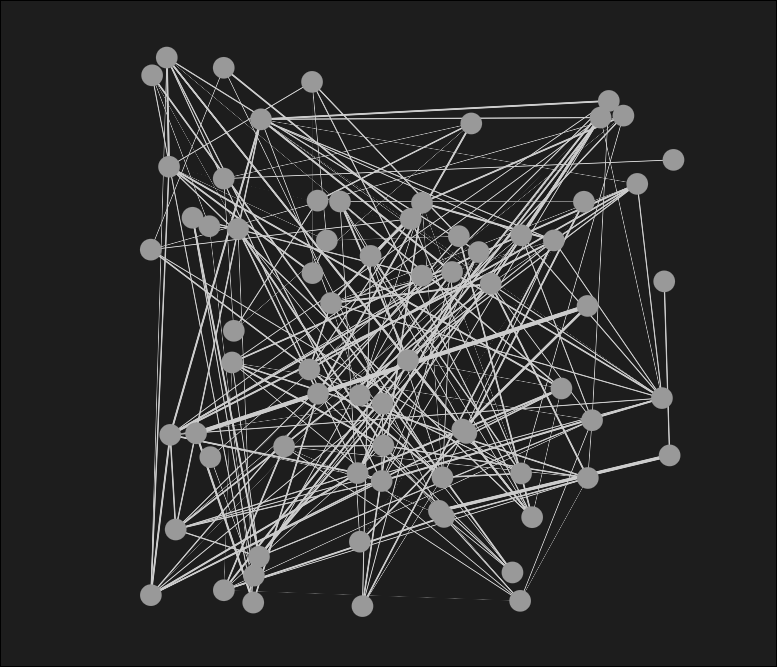

### 5.2 Imagem do grafo resultante

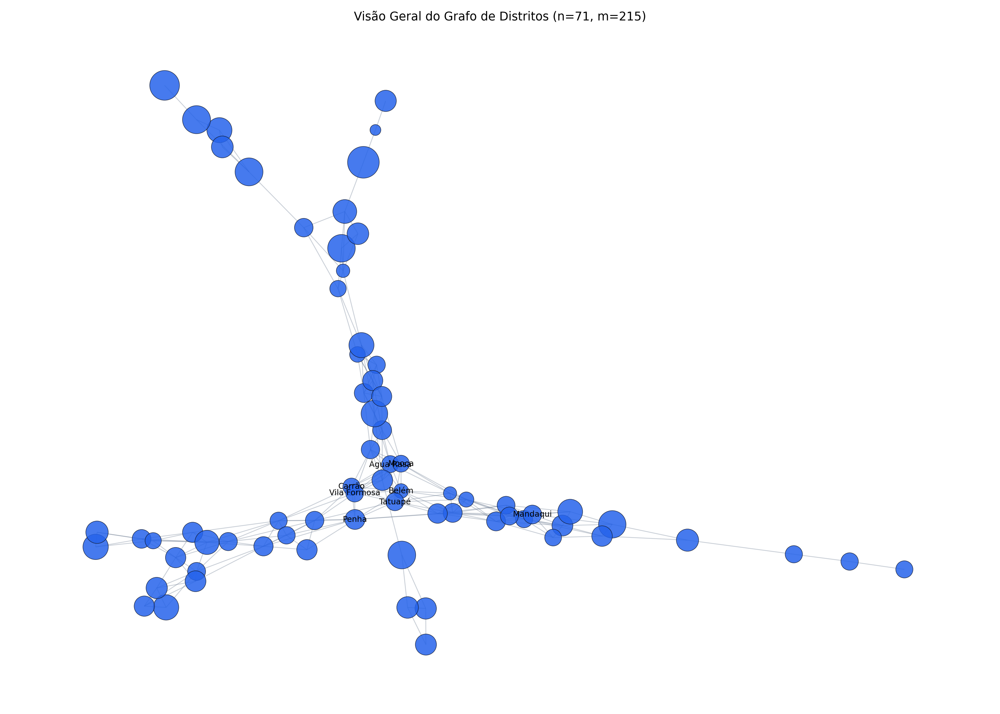

### 5.3 Imagens técnicas complementares

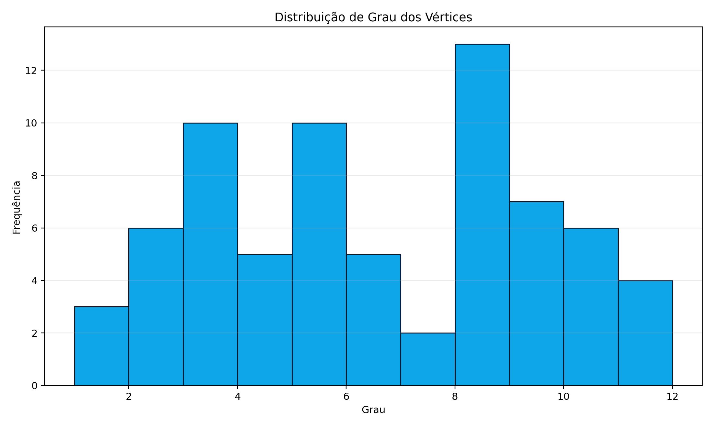

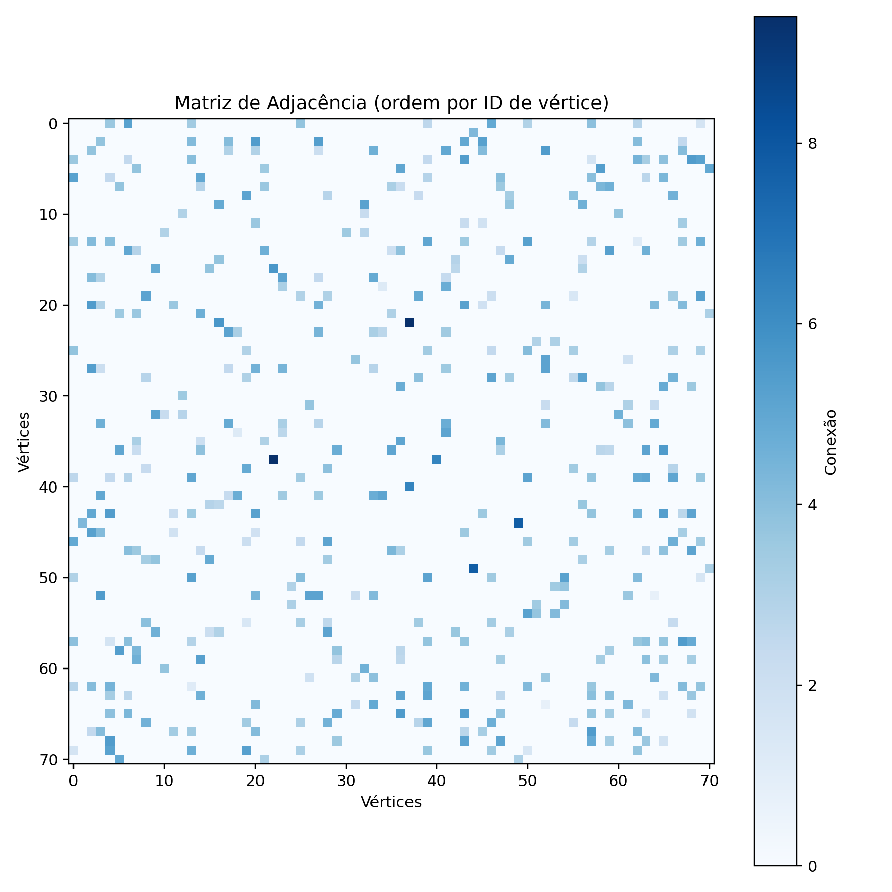

## 6) Métricas estruturais do grafo

Fonte: [figuras/metricas.json](figuras/metricas.json)

- Tipo: 3 (não orientado, ponderado)
- Vértices: 71
- Arestas: 215
- Grau médio: 6.06
- Grau máximo: 11
- Grau mínimo: 1
- Densidade: 0.0865
- Conexidade: **conexo** (1 componente)

## 7) Desenvolvimento da aplicação com menu de opções (a-j)

Arquivo principal: [projeto_grafo_menu.py](projeto_grafo_menu.py)

Funcionalidades implementadas conforme enunciado:

- `a)` Ler dados do arquivo `grafo.txt`
- `b)` Gravar dados no arquivo `grafo.txt`
- `c)` Inserir vértice
- `d)` Inserir aresta
- `e)` Remover vértice
- `f)` Remover aresta
- `g)` Mostrar conteúdo do arquivo
- `h)` Mostrar grafo (lista de adjacência)
- `i)` Apresentar a conexidade do grafo e o reduzido
- `j)` Encerrar aplicação

Observação técnica relevante:

- Para grafo não orientado (tipo 3), a opção `i` informa conectividade (conexo/desconexo).
- A parte de “reduzido” foi validada adicionalmente com um grafo direcionado de teste.

## 8) Objetivos ODS contemplados e justificativa

### ODS 3 — Saúde e Bem-Estar
O tema central do projeto é acesso territorial a serviços de saúde, conectando diretamente a modelagem ao objetivo de saúde e bem-estar.

### ODS 10 — Redução das Desigualdades
A análise por grafos evidencia diferenças regionais de conectividade e acesso, apoiando leitura de desigualdades territoriais.

### ODS 11 — Cidades e Comunidades Sustentáveis
Os resultados podem apoiar planejamento urbano e melhor distribuição territorial de serviços públicos essenciais.

## 9) Printscreen de testes da execução do menu (mínimo: 2 por opção)

Evidências textuais consolidadas:

- [evidencias/testes_menu.txt](evidencias/testes_menu.txt)
- [evidencias/teste_i2_direcionado.txt](evidencias/teste_i2_direcionado.txt)
- [evidencias/validacao_grafo.txt](evidencias/validacao_grafo.txt)

Evidências em PNG (prints):

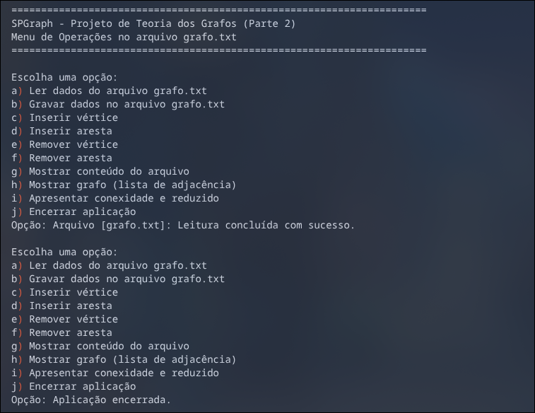

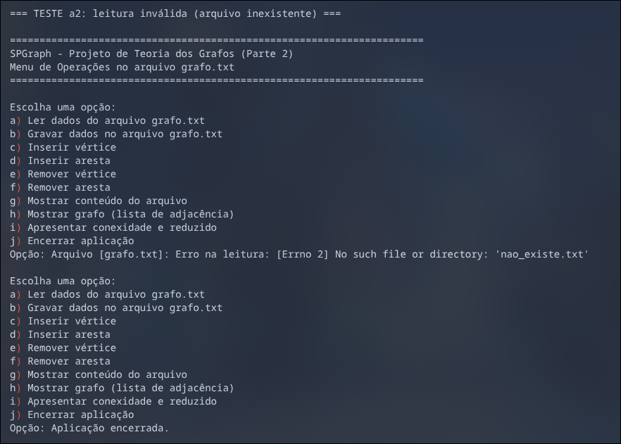

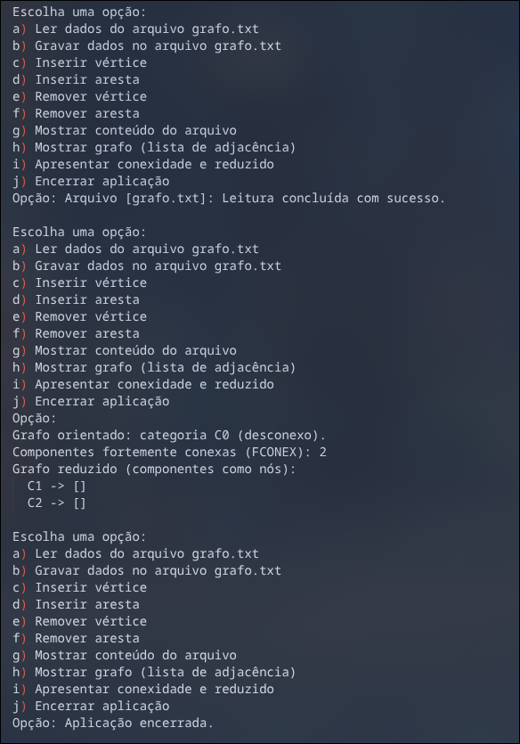

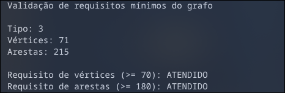

### 9.1 Galeria completa de imagens (todas as imagens da entrega)

#### Imagens técnicas da modelagem

#### Prints coletados da execução/modelagem

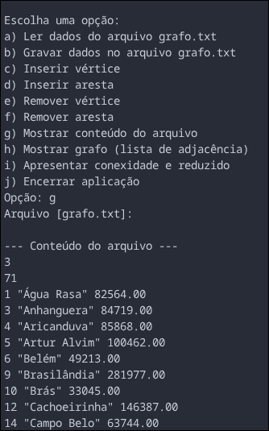

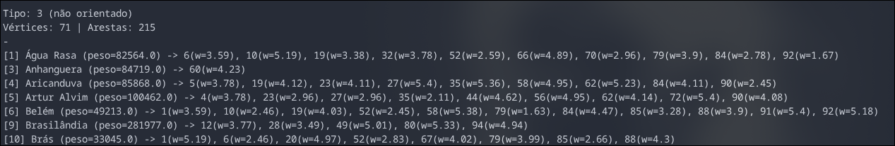

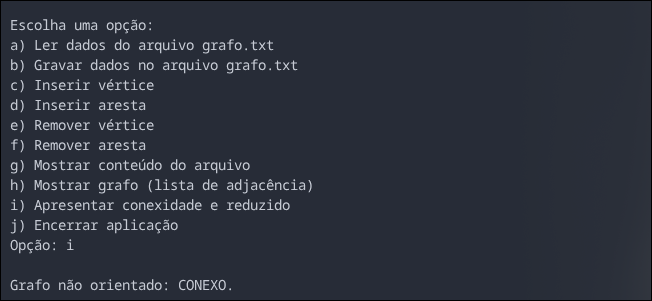

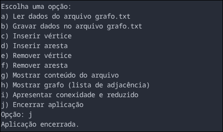

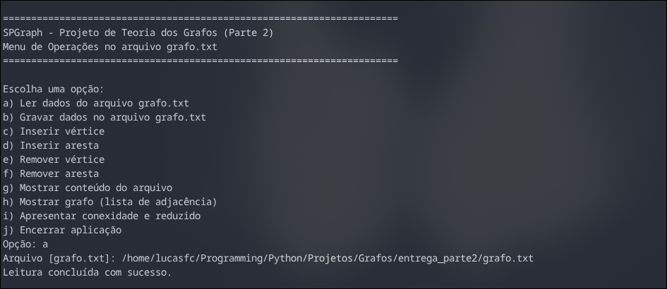

### 9.2 Checklist de cobertura dos testes (2 por item)

- `a1`, `a2` — leitura válida e inválida.
- `b1`, `b2` — gravação padrão e gravação em nome alternativo.
- `c1`, `c2` — inserção de novo vértice e tentativa de duplicado.
- `d1`, `d2` — inserção de aresta válida e inválida.
- `e1`, `e2` — remoção de vértice existente e inexistente.
- `f1`, `f2` — remoção de aresta existente e inexistente.
- `g1`, `g2` — exibição de conteúdo de arquivo existente e inexistente.
- `h1`, `h2` — lista de adjacência com arquivo carregado e sem carregar.
- `i1`, `i2` — conectividade em não orientado e categoria/reduzido em direcionado de teste.
- `j1`, `j2` — encerramento imediato e encerramento após operações.

## 10) Conformidade com os itens obrigatórios do enunciado

### 10.1 Relatório completo (Template)

- Dados dos integrantes: **atendido**.
- Título provisório da aplicação: **atendido**.
- Introdução + problema real detalhado + modelagem + imagem: **atendido**.
- ODS com justificativa: **atendido**.
- Prints de testes do menu (2 por opção): **atendido** (com evidências textuais e prints coletados).
- Apêndice com link do GitHub: **atendido**.

### 10.2 Conteúdo obrigatório no GitHub público

- Relatório do projeto: **atendido**.
- Arquivo `grafo.txt`: **atendido**.
- Arquivos fonte com cabeçalho (integrantes, síntese, histórico): **atendido**.
- Documentação interna/comentários: **atendido**.

## 12) Apêndice — Link do projeto no GitHub

Repositório público:

- https://github.com/Lucas-FcNw/RedeAcesso

